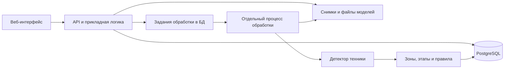

# План реализации: мониторинг строительных площадок

> Уточнение 23.09.2026: сроки загружаются отдельно по нашему формату. Основной сценарий — импорт пользовательского графика; расчёт сроков становится вспомогательным. Анализ расширяется на все классы текущей модели, включая людей, СИЗ и конусы. Реализованный формат, ограничения и следующие шаги описаны в [docs/TIMELINE_AND_SCENE.md](docs/TIMELINE_AND_SCENE.md). Детали ниже сохраняют исходный план и читаются с учётом этого уточнения.


Версия 1.2 · 21 сентября 2026 года · статус: P0 в работе, реализована первая итерация основы приложения.

Результаты реализации и оставшиеся задачи: [docs/P0_STATUS.md](docs/P0_STATUS.md). Запуск: [README.md](README.md). Готовы аудит, импорт с предпросмотром, демонстрационный расчёт графика, площадки/камеры/зоны, одиночная загрузка снимков и тестируемое ядро правил с историей. Добавлены адаптер детектора, запуск анализа из UI и просмотр рамок с зоной. Проверенных весов, worker и независимой размеченной выборки пока нет; P0 не завершена.

## 1. Основание и цель

Источник: «7. Департамент градостроительной политики города Москвы.pdf», 7 страниц. Ссылки на страницы ниже используют номера страниц PDF, включая титульную. Требования документа рассматриваются как требования к продукту и сдаче на хакатоне; после подготовки плана началась реализация P0.

**Цель:** создать работающий веб-прототип, который получает снимки строительной площадки и перечень этапов из Excel заказчика, использует самостоятельно найденные в интернете сведения для построения графика, обнаруживает технику, сопоставляет наблюдения с работами в нужной зоне и показывает объяснимые предупреждения со снимками-доказательствами.

Уточнение от заказчика задачи: календарные сроки не предоставляются. Предоставленный Excel используем как основу графика с иерархией и приблизительной последовательностью работ. Поиск внешних сведений, их сопоставление с этим перечнем и построение графика входят в объём реализации. Это уточнение рабочего подхода, а не дословное требование исходного PDF.

Главная демонстрационная цепочка:

> Excel заказчика → поиск источников → обогащение этапов → график с указанием происхождения сроков → активный этап и зона → ожидаемая техника → обнаруженная техника → предупреждение с объяснением.

Присутствие техники не доказывает выполнение работ. Отсутствие детекции не доказывает отсутствие техники. Поэтому продукт сообщает о признаках отклонения и необходимости проверки, а не устанавливает юридический факт нарушения и не вычисляет реальный процент готовности объекта по одному кадру.

## 2. Что требует ТЗ

| Требование | Где в ТЗ | Как реализуем и проверим |
|---|---|---|
| Обнаруживать и классифицировать строительную технику | Стр. 3, раздел 2 | Модель выдаёт класс, рамку и оценку уверенности; качество проверяется на отложенных изображениях |
| Связывать технику с этапами календарного графика | Стр. 3 | Импорт графика, привязка зон, явный справочник правил; виден путь от строки графика до результата |
| Выявлять отсутствие необходимой и появление несоответствующей техники | Стр. 3 | Два обязательных типа предупреждений с проверками даты, зоны, видимости и разрешённых классов |
| Визуализировать результаты | Стр. 3 | Экран площадки, размеченные снимки, план и карточка предупреждения |
| Демонстрировать на обычном компьютере | Стр. 3 | Локальный запуск и измерение скорости на CPU; GPU необязателен |
| Подготовить собственную проверочную выборку | Стр. 5 | Разметка, разделение по источникам/камерам, независимый итоговый прогон |
| Представить промежуточный результат | Стр. 5 | Репозиторий и описание до 2 страниц с подходом, прогрессом и оставшимися работами |
| Представить финальный результат | Стр. 6 | Открытый репозиторий, доступный прототип, презентация PPTX/PDF, документация DOC/PDF |
| Описать установку камер | Стр. 4 | Раздел презентации с рекомендациями по обзору, перекрытиям, освещению и контрольным кадрам |
| Объяснить модель данных, ограничения и запуск | Стр. 4 | Сопроводительный PDF и воспроизводимая инструкция в репозитории |

ТЗ допускает любой подходящий стек. Docker желателен. Конкретных порогов качества, SLA, количества экранов или обязательной интеграции с видеопотоками в документе нет.

## 3. Объём первой версии

### Обязательно к финалу — P0

1. Создание площадки, камер и зон наблюдения.
2. Загрузка перечня работ CSV/XLSX без обязательных дат с предпросмотром и проверкой ошибок.
3. Сохранение иерархии; поиск и сопоставление внешних источников, построение графика и настройка правил для исполняемых этапов.
4. Загрузка снимка или пакета снимков с камерой и временем съёмки.
5. Реальное распознавание техники и просмотр рамок на исходном снимке.
6. Выбор действующих этапов по времени снимка и зоне.
7. Проверка необходимой и допустимой техники по явным правилам.
8. Предупреждения с объяснением и отдельное состояние «недостаточно данных».
9. История результатов, фильтры, карточка предупреждения.
10. Воспроизводимый запуск, собственная тестовая выборка, материалы сдачи.

Справочник проектируем под все 8 перечисленных в ТЗ типов: самосвал, экскаватор, каток, кран-манипулятор, бетоносмеситель, бульдозер, грузовик, автокран. Это целевой охват. Фактическую поддержку каждого класса фиксируем после проверки данных; не называем класс поддержанным только потому, что он внесён в справочник.

Для первого сквозного сценария используем «Разработку котлована» и пару «экскаватор + самосвал». Затем добавляем несколько семейств этапов и остальные доступные классы. Недостаток данных для класса отражаем как ограничение и задачу по расширению выборки.

### Улучшения после устойчивой P0 — P1

- Анализ последовательности снимков и подавление повторных предупреждений.
- Редактирование правил через интерфейс с историей версий.
- Ручная оценка предупреждения: подтвердить, отклонить, прокомментировать.
- Сводка по зонам и интервалам, экспорт результатов.
- Более удобная временная шкала графика и повторное воспроизведение наблюдений.

### После хакатона — P2

RTSP/видеопотоки, отслеживание движения, объединение объектов между камерами, BIM/GIS, интеграции с корпоративными системами, разграничение доступа для организаций, прогноз сроков на основании дополнительных данных. Наличие техники само по себе недостаточно для достоверного прогноза задержки.

## 4. Пользовательский сценарий и интерфейс

Основной пользователь — инженер или руководитель проекта, проверяющий соответствие наблюдений плану.

1. Открывает площадку, задаёт тип и известные характеристики объекта, импортирует перечень работ.
2. Сопоставляет столбцы файла с полями системы, исправляет ошибки. Проверяет найденные для этапов источники, зависимости, длительности и допущения расчёта.
3. Задаёт известную дату начала или контрольную дату, получает график, выбирает зоны и шаблоны правил. При отсутствии календарной привязки видит относительную последовательность и недостающие данные; демонстрационная дата отмечается явно.
4. Добавляет камеру и обозначает наблюдаемую зону многоугольником на контрольном кадре.
5. Загружает снимки, задаёт время съёмки и запускает анализ.
6. Видит текущие этапы, распознанную технику и статусы проверки.
7. Открывает предупреждение: что ожидалось, что обнаружено, где и когда, какое правило сработало, какие ограничения влияют на вывод.

### Экраны

- **Обзор площадки:** выбранный период, зоны, число предупреждений, время последнего наблюдения. Нет данных и отсутствие отклонений отображаются разными состояниями.
- **График и правила:** иерархическая таблица, зависимости, длительности и даты, источники и допущения, происхождение сроков, зона, семейство работ, требуемые/допустимые классы, статус настройки. Есть предпросмотр расчёта и корректировка исходных параметров.
- **Снимки и обработка:** загрузка, очередь, ошибки отдельных файлов, просмотр рамок и зон.
- **Предупреждение:** этап, тип отклонения, ожидаемое/наблюдаемое, снимки, версия правила и модели, пояснение ограничений.

Первый интерфейс — на русском языке, с понятными пустыми состояниями и текстовыми статусами дополнительно к цветам. Профессиональную карту Москвы для MVP не строим: зоны на кадрах дают более прямую связь с доказательствами.

## 5. Входные данные и подготовка

### График

Предоставленный файл «Сводный перечень строительных работ_ЛТЦ.xlsx» содержит справочник видов работ и их применимость к типам объектов. Используем его как основу графика. Дат начала и окончания в нём нет; порядок строк даёт предварительную последовательность, но не доказывает зависимости и запрет параллельных работ.

Внутренний контракт этапа: `external_id`, `parent_id`, `source_row`, `name`, `sequence_index`, `object_types`, `start_date`, `end_date`, `zone_id`, `stage_type`. Даты допускают отсутствие при импорте. Сохраняем исходные номера и значения отдельно от нормализованных; недостающие зоны и типы этапов задаём при настройке. Для строк без номера создаём устойчивый внутренний идентификатор с привязкой к версии файла и строке.

В Excel обнаружены 19 значений типа «дата» в столбце нумерации, предположительно из-за автоматического преобразования номеров разделов. Их нельзя принимать за сроки работ: восстановление номеров и иерархии показываем в предпросмотре и проверяем по соседним строкам.

Импорт должен:

- поддерживать выбор листа XLSX и сопоставление столбцов;
- сохранять исходные названия и иерархию;
- обнаруживать дубли идентификаторов, отсутствующих родителей, циклы и некорректные даты, если даты переданы; отсутствие дат не является ошибкой импорта;
- показывать ошибки до сохранения и не оставлять частично импортированный график;
- различать итоговые строки и исполняемые работы, чтобы не удваивать требования;
- не запрещать пересечение сроков: параллельные работы допустимы;
- создавать версию графика для воспроизводимости прошлых результатов.

Если есть только даты, считаем конечную дату включительной в часовом поясе площадки. Для Москвы — `Europe/Moscow`. Внутри храним точные моменты времени в UTC. Текущая дата компьютера не заменяет дату снимка.

### Поиск источников и обогащение перечня работ

Самостоятельно исследуем открытые интернет-источники. Сначала ищем документы конкретного объекта, если известны его название, адрес или идентификатор: опубликованные графики, проекты организации строительства, проектную и закупочную документацию. Совпадение объекта, актуальность версии и детализацию сроков проверяем; дата сдачи объекта сама по себе не задаёт даты всех этапов.

Если график объекта недоступен, ищем применимые технологические карты, документы по организации строительства, нормы затрат труда и машинного времени, сведения о производительности техники и документированные примеры аналогичных объектов. Отправная точка исследования — [СП 48.13330.2019 в каталоге Росстандарта](https://protect.gost.ru/sp/details/278f4ffa-b29b-4733-b8ac-d9a5ff3775cc); это направление поиска, а не готовый источник длительностей всех работ. Перед использованием проверяем редакцию и условия применимости каждого документа.

Для каждого выбранного семейства работ:

1. Сопоставляем название, синонимы, родительский этап, тип объекта и технологию со строками Excel. Одного сходства названий недостаточно.
2. Извлекаем зависимости и возможность параллельного выполнения, необходимую технику, единицы объёма, трудоёмкость или производительность, длительности и ограничения применимости.
3. Сохраняем URL, название и редакцию документа, дату обращения, страницу/раздел, извлечённое значение, единицы и условия использования. Связываем запись с конкретными строками исходного файла.
4. Отмечаем сопоставление как проверенное, предварительное или не найденное, с объяснением. Противоречащие источники показываем отдельно; не усредняем несовместимые нормы.
5. Проверяем сопоставления для демонстрационного сценария вручную. Автоматическое предложение допустимо, но не становится проверенным без проверки.

Для P0 достаточно подготовленного командой, версионируемого справочника источников и сопоставлений для выбранных семейств этапов. Поиск выполняем при подготовке данных; автономный веб-поиск при каждом анализе снимка не требуется. Непокрытые работы сохраняем со статусом «недостаточно данных для расчёта».

### Построение календарного графика

Различаем происхождение сроков:

- **Документированный план объекта:** даты найдены в документе, принадлежность объекту и версия проверены. Показываем источник; это плановые даты, а не доказательство фактического выполнения.
- **Расчётный график:** даты получены из внешних сведений и параметров объекта. Показываем формулу, параметры, диапазон длительности при наличии и принятые допущения.
- **Демонстрационный график:** недостающие параметры или календарная привязка заданы для показа. Явно отмечаем это во всех результатах.

Происхождение фиксируем для каждого этапа: в одном графике могут сочетаться документированные и расчётные сроки. Пользовательская корректировка сохраняется отдельно с причиной и не становится документированным сроком автоматически.

Для расчёта нужны тип и масштаб объекта, объёмы работ, технология, число и производительность машин/бригад, сменность, рабочий календарь, зависимости и календарная привязка. Состав обязательных параметров зависит от метода расчёта. Например, при известной выработке одной машины за смену ориентировочная длительность в рабочих днях равна объёму, делённому на произведение выработки, числа машин и смен в день. Это упрощение применяем только при обоснованной совместной работе машин и согласованных единицах; учитываем технологические выдержки, ограничения ресурсов и округление по выбранной методике. Нормы трудозатрат не подменяем календарными днями.

Строим граф зависимостей без циклов, допускаем обоснованные параллельные этапы, переводим рабочую длительность в календарные даты с учётом расписания. Для P0 достаточно проверенных зависимостей и явного указания ресурсных ограничений; оптимизатор распределения ресурсов не обязателен. Дата начала либо другая контрольная дата должна быть найдена, введена или явно обозначена как демонстрационная. Без неё строим относительный график, но не определяем автоматически активный этап по дате снимка.

Не выводим неизвестные сроки только из порядка строк и не определяем ожидаемый этап по той же технике на снимке, которую затем проверяем: это сделало бы проверку соответствия круговой. Ручной выбор этапа допустим как явно отмеченный вспомогательный режим, но не заменяет поиск источников и расчёт графика.

Сохраняем версию расчёта, источники, зависимости, параметры и допущения. Изменение любого из них создаёт новую версию графика. Если неопределённость сроков меняет выбор активного этапа и вывод о соответствии, показываем «недостаточно данных» с возможными этапами вместо однозначного предупреждения.

### Снимки

Обязательные метаданные: площадка, камера, время съёмки и источник времени. При отсутствии достоверного времени пользователь вводит его явно. Для демонстрационных назначений ставим отметку; время загрузки не выдаём за время съёмки.

Проверяем формат, возможность декодирования, размеры, повторную загрузку и принадлежность камере. Храним исходник, контрольную сумму, метаданные и отдельно результаты анализа. Для пакетов поддерживаем сопроводительный CSV с именами файлов и временем; ограничиваем размеры и число файлов. Ошибка одного снимка не останавливает весь пакет.

### Датасет

В ТЗ указан неразмеченный архив до 200 МБ и до 5 ссылок. В предоставленных материалах есть файл с пятью ссылками на открытые датасеты; их содержимое и пригодность для обучения предстоит исследовать. Excel уже просмотрен и используется как основа графика без сроков. До подготовки проверенного набора изображений используем явно обозначенные демонстрационные данные.

Порядок подготовки:

1. Инвентаризировать источники, разрешения использования, классы, камеры, освещение, сезонность и качество.
2. Удалить точные дубли, объединить похожие кадры в группы одного источника.
3. Зафиксировать инструкцию разметки: рамки, частичное перекрытие, маленькие объекты, неоднозначные типы.
4. Размечать целевые классы и негативные кадры без техники; перепроверять спорные примеры.
5. Разделить данные на обучение, настройку и независимую проверку по камерам/сценам, а не случайно по соседним кадрам. Ориентир 70/15/15 применим только при достаточном числе независимых групп.
6. Зафиксировать тестовый набор до подбора порогов. Аугментированные копии и близкие кадры одного источника не должны попадать в разные части.
7. В итоговом отчёте указать реальные размеры выборок и число объектов каждого класса. При малой выборке явно ограничить силу выводов.

## 6. Распознавание техники

### Выбор модели

Начальный кандидат — компактный объектный детектор семейства YOLO с дообучением на целевых классах. Конкретные веса выбираем после аудита классов, условий использования и замера на доступном компьютере.

Нельзя считать обычную COCO-модель готовой к задаче: её категории транспорта не дают все требуемые различия строительной техники. Состав категорий проверяется по [официальному описанию COCO в Ultralytics](https://docs.ultralytics.com/datasets/detect/coco).

Порядок:

1. Запустить доступную исходную модель на небольшой размеченной выборке.
2. Проверить покрытие восьми классов, ошибки и скорость на CPU.
3. Дообучить компактную модель; выбрать пороги на валидации отдельно для классов.
4. Особо проверить пары «грузовик/самосвал», «автокран/кран-манипулятор», «бульдозер/экскаватор».
5. При нехватке данных оставить неоднозначный объект для проверки; общий класс «грузовик» не подтверждает наличие самосвала.
6. Проверить экспорт в ONNX и совпадение результатов с исходной моделью. Для CPU-кандидата используем ONNX Runtime: он предоставляет CPU execution provider, см. [документацию](https://onnxruntime.ai/docs/execution-providers/).

Контракт результата: класс, оценка уверенности, рамка в координатах исходного изображения, версия модели. Оценку модели не называем вероятностью нарушения.

Отдельно проверяем качество кадра: сильная темнота, размытие, слишком маленькое разрешение. Эвристики качества настраиваем на примерах и не считаем доказательством полной видимости зоны. Смена ракурса камеры требует обновления разметки зоны.

Заглушка детектора допустима для ранних тестов интерфейса и правил, но в финальном сквозном сценарии используем реальную модель и явно отделяем фиктивные тестовые данные.

## 7. Методика сопоставления

### Шаблон правила

Храним: семейство этапа, обязательные классы или группы альтернатив, допустимые дополнительные классы, зону, рабочее расписание при наличии, пороги модели, требования к видимости, режим одного кадра/окна, версию и текст объяснения.

Стартовые примеры — наши гипотезы для демонстрации, а не универсальные строительные нормативы:

| Семейство работ | Пример необходимой техники | Что уточняется |
|---|---|---|
| Разработка котлована | Экскаватор и самосвал | Циклы вывоза, разные зоны погрузки и проезда |
| Бетонирование | Бетоносмеситель | Способ подачи, интервалы доставки |
| Уплотнение основания | Каток | Технология конкретной работы |
| Монтаж/разгрузка | Автокран или кран-манипулятор | Допустимость замены по конкретному этапу |

Неизвестный этап получает статус «правило не настроено». Автоматический подбор по названию можно предложить пользователю, но нельзя молча считать достоверным.

### Алгоритм

1. Определить момент съёмки, площадку и версии конфигурации.
2. Найти все активные исполняемые этапы в зоне с учётом дат, рабочего расписания и происхождения сроков. Проверить календарную привязку и неопределённость расчёта; если они не позволяют выбрать этапы, вернуть «недостаточно данных».
3. Отнести детекции к зоне по нижней центральной точке рамки; пограничные и неоднозначные случаи пометить для проверки.
4. Отфильтровать низкую уверенность; проверить качество и покрытие требуемой зоны камерой.
5. Для каждого этапа проверить обязательные группы техники.
6. Проверить несоответствующую технику относительно объединения допустимых классов всех одновременно активных этапов и общих разрешённых классов зоны.
7. Сохранить результат, причины, исходные наблюдения и версии модели, правил, графика, зон.

### Статусы

- **Соответствует наблюдениям:** необходимая техника обнаружена; это не подтверждение фактического объёма работ.
- **Возможное отсутствие необходимой техники:** техника не обнаружена при достаточных условиях наблюдения.
- **Техника вне перечня для текущих этапов:** найден класс, не объясняемый активными правилами; требуется проверка назначения техники.
- **Недостаточно данных:** плохой кадр, неизвестное время, неполное покрытие, неподдерживаемый класс, отсутствие настроенного графика/правила.

Отсутствие активного этапа само по себе не означает нарушение. Поведение вне рабочего времени задаётся отдельно. Ошибка модели/обработки не должна превращаться в «техника отсутствует».

### Один кадр и последовательность

На одиночном снимке формируем осторожный сигнал «не обнаружено на снимке». При наличии достоверной последовательности применяем окно наблюдения. Стартовая настраиваемая гипотеза: не менее 3 пригодных кадров за 15 минут и отсутствие класса на всех них. Эти числа не заданы ТЗ и требуют настройки под частоту снимков и цикл работы техники.

Нельзя использовать почти одинаковые дубликаты как независимые наблюдения. Несколько камер в MVP подтверждают присутствие класса, но их количества объектов не суммируются без устранения повторного учёта. Один объект не доказывает наличие отдельных машин для двух одновременных работ.

### Карточка предупреждения

Пример: «Зона А. Разработка котлована. По правилу нужны экскаватор и самосвал. На снимке 10:05 обнаружен экскаватор; самосвал не обнаружен. Возможен недостаток техники для вывоза грунта. Проверьте, не находится ли самосвал вне обзора или в рейсе».

Показываем снимок, рамки, границы зоны, время, ожидаемые и найденные классы, правило, ограничения, происхождение сроков и ссылки на источники графика. Для расчётного графика формулируем вывод «отклонение от расчётного сценария», а для демонстрационного явно указываем демонстрационный характер сроков. Не выдаём такое предупреждение за нарушение утверждённого плана объекта. Предупреждения одной причины в одном этапе и зоне объединяем в событие; восстановление наблюдаемого соответствия отмечаем отдельно от ручного подтверждения пользователем.

## 8. Архитектура



Предлагаемый стек:

| Компонент | Выбор | Причина |
|---|---|---|
| Интерфейс | React + TypeScript + Vite | Удобно объединить снимок, рамки, таблицу графика и предупреждения |
| API | Python + FastAPI + Pydantic | Общий язык с модулем распознавания, явные контракты данных |
| Хранение | PostgreSQL + SQLAlchemy + Alembic | Связанные сущности, версии и миграции |
| ML | PyTorch для обучения; компактный детектор; ONNX Runtime после проверки экспорта | Возможность обучения и отдельного CPU-запуска |
| Изображения | OpenCV/Pillow | Чтение, преобразование, проверка кадров |
| Задания | Таблица заданий и один отдельный worker | Минимум инфраструктуры для прототипа |
| Файлы | Локальный Docker volume с интерфейсом хранилища | Простой старт и возможность позже перейти на объектное хранилище |
| Упаковка | Docker Compose | Единый воспроизводимый запуск |

Тяжёлое распознавание выносим из HTTP-обработчика в отдельный процесс; документация FastAPI также выделяет тяжёлые фоновые вычисления как отдельный случай: [Background Tasks](https://fastapi.tiangolo.com/tutorial/background-tasks/).

Это модульное приложение с отдельным процессом обработки, а не набор микросервисов. Задания имеют состояния `queued/running/succeeded/failed`, лимит повторов, журнал ошибки и восстановление зависших заданий. Повтор обработки не создаёт дубли результатов: используем ключ снимка, модели и версии конфигурации.

## 9. Модель данных и API

Основные сущности:

| Сущность | Назначение и ключевые связи |
|---|---|
| Project | Площадка, часовой пояс |
| Camera | Принадлежность площадке |
| Zone / CameraZone | Зона работ, версия полигона и покрытие конкретной камерой |
| ScheduleVersion / Stage | Версия графика, исходная строка и внешнее ID, родитель, порядок, сроки и их происхождение, тип работ |
| SourceDocument / StageSourceMapping | URL и версия источника, дата обращения, раздел, извлечённые сведения и единицы, связь с работой, статус проверки сопоставления |
| StageDependency / ScheduleCalculation | Зависимости этапов, версия метода расчёта, параметры, календарная привязка, допущения, длительности и неопределённость |
| StageZone | Привязка этапа к одной или нескольким зонам |
| EquipmentClass | Справочник классов и синонимов |
| RuleVersion / StageRule | Условия правила и назначение этапу |
| Image | Исходник, контрольная сумма, камера, время и источник времени |
| AnalysisJob / AnalysisRun | Состояние задания, модель и версии конфигурации |
| Detection | Класс, confidence, bbox, зона, связь с запуском |
| Evaluation | Результат проверки этапа, включая норму и недостаток данных |
| Alert / AlertEvidence | Событие отклонения и ссылки на наблюдения/кадры |
| Review | Оценка пользователя, комментарий, время |

Принцип: прошлый анализ сохраняется с прежними версиями. Изменение графика или правила создаёт новый результат, а не переписывает объяснение задним числом.

Первичные группы API:

- Площадки, камеры и зоны: создание, чтение, настройка.
- Импорт перечня работ: предпросмотр → подтверждение проверенной версии, в том числе без дат.
- Обогащение и расчёт графика: источники и сопоставления → проверка параметров и зависимостей → предпросмотр → сохранение версии. Отдельно возвращаем недостающие данные и происхождение сроков.
- Правила: справочник, назначение этапу, валидация.
- Снимки: одиночная/пакетная загрузка и получение исходника.
- Анализ: запуск задания, статус, результаты и рамки.
- Предупреждения: список с фильтрами, карточка, доказательства, оценка пользователя.
- Состояние сервиса: готовность API, БД, worker и весов модели.

Договоримся о контрактах до разработки экранов: ошибки с понятными кодами, пагинация, идентификатор задания при асинхронной обработке. При размещении в интернете закрываем изменение демонстрационных данных доступом оператора, ограничиваем загрузки и защищаем пути файлов. Секреты не храним в репозитории.

## 10. Этапы разработки и критерии завершения

Сроки хакатона и ресурсы команды пока неизвестны. Ниже — порядок и ориентировочная доля доступного времени, а не обещание календарных сроков. Каждый этап заканчивается проверяемым результатом.

### Этап 0. Уточнить входные данные — 8%

- Инвентаризировать архив изображений и предоставленный Excel без сроков; уточнить даты сдачи и характеристики компьютера.
- Проверить восстановление нумерации и иерархии Excel. Для первого сценария найти внешние источники сроков, технологии и техники, сопоставить их с работами, зафиксировать параметры объекта и календарную привязку либо явные демонстрационные допущения.
- Проверить полноту метаданных, классы и доступность обучения.
- Зафиксировать допущения, поддерживаемые сценарии и словарь классов.
- Подготовить первые примеры «норма», «нет необходимого класса», «несоответствующая техника», «плохие данные».

**Готово:** есть контракт входных данных, первоначальная разметка, проверенные сопоставления источников для первого сценария, первоначальный график с происхождением сроков и список рисков. Без временных рядов не обещаем временной анализ реальных данных.

### Этап 1. Каркас и первый сквозной сценарий — 12%

- Создать структуру репозитория, конфигурацию, БД и миграции.
- Реализовать загрузку снимка, задание обработки и простой экран результата.
- Подключить реальный детектор к единому интерфейсу.
- На одном проверенном правиле провести снимок до карточки результата.

**Готово:** после локального запуска новый снимок проходит всю цепочку; результат сохраняется. Ограничения исходной модели видны.

### Этап 2. Данные и качество детектора — 22%

- Завершить разметку и независимое разделение данных.
- Проверить исходную модель, дообучить при необходимости.
- Настроить пороги на валидации, измерить качество каждого класса и CPU-скорость.
- Сохранить веса, инструкцию получения, конфигурацию и отчёт.

**Готово:** модель воспроизводимо распознаёт заявленные классы; есть измерения и честный список слабых случаев. Проверочная выборка не использовалась для выбора порогов.

### Этап 3. Обогащение данных, расчёт графика, зоны и правила — 18%

- Реализовать импорт CSV/XLSX без обязательных дат, иерархию и версии графика.
- Расширить справочник внешних источников и проверенных сопоставлений для выбранных семейств работ. Реализовать зависимости, расчёт длительности и дат, рабочий календарь, происхождение сроков и сохранение допущений.
- Добавить настройку зон и назначение правил.
- Реализовать активные этапы, обязательные группы, допустимые классы и неопределённость.
- Проверить пересечения этапов, даты, плохие кадры и отсутствие настроек.

**Готово:** из Excel и проверенных внешних сведений воспроизводимо строится график; недостающие параметры видны. Один и тот же набор детекций даёт разные объяснимые результаты для разных действующих правил; каждый вывод связан с исходной строкой, источниками сроков, версией расчёта и снимком.

### Этап 4. Пользовательский интерфейс — 15%

- Довести четыре основных экрана до завершённого сценария.
- Добавить фильтры, состояние очереди, ошибки и повторный анализ.
- Сделать карточки доказательств понятными без объяснения разработчика.
- При наличии времени реализовать объединение предупреждений и временные окна.

**Готово:** пользователь проходит путь от импорта до объяснения предупреждения без правки исходного кода.

### Этап 5. Приёмка и воспроизводимость — 13%

- Выполнить итоговый прогон модели и проверок правил.
- Измерить полную задержку на целевом компьютере.
- Проверить повторные загрузки, повреждённый файл, перезапуск worker и отсутствие модели.
- Проверить запуск в чистом окружении, сохранность данных после перезапуска и доступный жюри способ проверки.

**Готово:** P0-сценарии проходят, результаты воспроизводимы, измерения записаны вместе с характеристиками оборудования.

### Этап 6. Материалы и защита — 12%

- Подготовить презентацию, сопроводительный PDF, README и инструкции запуска.
- Записать резервное видео и подготовить демонстрационный набор с описанным происхождением.
- Проверить ссылки и доступность прототипа, весов и разрешённых к распространению данных.
- Провести репетицию показа от графика до предупреждения.

**Готово:** все четыре финальных результата доступны и согласованы между собой; заявленные возможности подтверждаются демонстрацией.

Промежуточную сдачу готовим к фактическому дедлайну организаторов: описание до 2 страниц должно честно отражать достигнутые этапы. При дефиците времени сначала сокращаем P1 и оформление, сохраняя реальные детекции, график, оба типа отклонений, доказательства и проверку качества.

## 11. Проверка качества

### Детектор

- Precision и recall отдельно по классу: насколько часто находки верны и сколько реальных объектов найдено.
- mAP@0.5 и mAP@0.5:0.95 для качества классов и рамок.
- Таблица ошибок между похожими классами.
- Срезы по условиям съёмки, размеру объекта и перекрытию, если данных достаточно.
- Число изображений и объектов в каждом срезе.

Не фиксируем выдуманную «точность 95%». Целевые численные значения утверждаем после исходного замера, до итогового прогона. Если класс не проходит согласованный порог, дорабатываем модель или явно ограничиваем область применения.

### Источники и расчёт графика

- Импорт исходного Excel проходит без дат; значения типа «дата» в нумерации не становятся сроками работ.
- Для выбранных этапов проверены соответствие источника технологии и типу объекта, единицы, исходные значения и привязка к строкам Excel.
- Контрольный расчёт длительности и дат проверен вручную; учтены рабочий календарь, технологические выдержки, зависимости и параллельные этапы.
- Циклические зависимости, несовместимые единицы и отсутствующие обязательные параметры блокируют соответствующий расчёт с понятной причиной.
- Без календарной привязки остаётся относительный график; автоматический выбор этапа по дате снимка недоступен.
- Документированные, расчётные и демонстрационные сроки различимы в интерфейсе и предупреждениях; изменение параметров создаёт новую версию и сохраняет прежние результаты.
- Если допустимые варианты сроков дают разные активные этапы и выводы, результат — «недостаточно данных».

### Правила

Обязательные автоматические сценарии:

1. Нужные классы найдены в правильной зоне и в срок → соответствие наблюдениям.
2. Обязательный класс не найден при пригодных условиях → предупреждение.
3. Найден недопустимый класс → предупреждение.
4. Класс допустим для другого параллельного этапа → нет ложного предупреждения о несоответствии.
5. Кадр плохой, нет покрытия или времени → недостаточно данных.
6. Нет активного этапа/правила → понятный статус, не доказательство нарушения.
7. Детекция из другой зоны не закрывает требование.
8. Работает группа альтернатив «автокран или кран-манипулятор».
9. Граница даты и часовой пояс не меняют активность этапа ошибочно.
10. Повторный запуск не создаёт дубли; смена версии сохраняет историю.

Для итоговой системы отдельно размечаем ожидаемые предупреждения по сочетаниям «кадр + график + зона + правило». Измеряем ложные и пропущенные предупреждения и долю «недостаточно данных». Хорошие метрики детектора не заменяют проверку правильности выводов.

### Скорость и устойчивость

Измеряем p50/p95 времени одного снимка, время пакета, память и задержку до появления результата. Указываем CPU/GPU, разрешение, размер модели, прогрев и настройки. Интерфейс должен оставаться доступным во время обработки. Числовой бюджет задержки определяем по первому замеру на ноутбуке, поскольку ТЗ его не задаёт.

## 12. Демонстрация и сдача

Основной показ:

1. Импорт Excel заказчика, показ сопоставленных внешних источников и расчёт графика для этапа котлована. Показ параметров, календарной привязки и происхождения сроков.
2. Показ зоны и правила «экскаватор + самосвал».
3. Снимок с обоими классами — соответствие наблюдениям.
4. Снимок без обнаруженного самосвала — предупреждение с доказательствами.
5. Пример техники вне допустимого перечня — второй обязательный тип предупреждения.
6. Непригодный снимок — система показывает недостаток данных.
7. Показ независимых метрик и известных ограничений.

План презентации: проблема → сценарий → архитектура → распознавание и данные → методика правил → демонстрация → качество и скорость → ограничения → рекомендации по камерам → масштабирование.

Рекомендации по камерам: покрывать рабочие зоны и подъезды, избегать сильных перекрытий и контрового света, проверять различимость самых маленьких целевых объектов контрольными кадрами, синхронизировать время, пересматривать зоны после перемещения камеры. Универсальные высоты и разрешения без испытаний не обещаем; критерий — фактическое качество распознавания на конкретной сцене.

Комплект финальной сдачи:

- [ ] Открытый репозиторий с читаемым кодом и лицензиями компонентов.
- [ ] Доступная ссылка на работающий прототип и инструкция для жюри.
- [ ] Презентация PPTX или PDF.
- [ ] Сопроводительная документация PDF: модель данных, алгоритмы, датасеты, поддерживаемые классы/этапы, ограничения, сборка и запуск.
- [ ] Веса модели или воспроизводимый способ их получения с контрольной суммой.
- [ ] Проверочный набор в пределах прав на распространение либо инструкции получения и manifest.
- [ ] Реестр источников для графика и техники, сопоставления со строками Excel, параметры и воспроизводимый пример расчёта сроков с обозначенными допущениями.
- [ ] Отчёт о качестве и скорости, демонстрационные сценарии и резервное видео.

## 13. Организация дальнейшей реализации

Планируемая структура репозитория:

```text
apps/web/                 # Пользовательский интерфейс
backend/app/api/          # HTTP-контракты
backend/app/domain/       # Этапы, зоны, правила, предупреждения
backend/app/services/     # Импорт и анализ
backend/app/inference/    # Адаптер детектора
backend/app/workers/      # Обработка заданий
backend/migrations/      # Схема БД
ml/                      # Обучение, оценка, конфигурации
configs/rules/           # Версионируемые шаблоны
configs/scheduling/      # Зависимости и методы расчёта сроков
data/sources/            # Реестр внешних источников и сопоставления с Excel
data/manifests/          # Происхождение и разделение данных
tests/                   # Правила, импорт, интеграция
docs/                    # Архитектура, ограничения, запуск
demo/                    # Сценарии и разрешённые примеры
compose.yaml
IMPLEMENTATION_PLAN.md
```

После каждого этапа обновляем статус плана: выполнено, результаты проверки, ограничения, следующий шаг. Изменения архитектуры фиксируем вместе с причиной. Сначала доводим один реальный сквозной сценарий, затем расширяем охват; оформление финальных материалов начинается до окончания разработки.

Первая итерация: выполнен аудит Excel и снимков, реализованы предлагаемая иерархия и импорт, предварительное сопоставление технологического источника, демонстрационный расчёт, контракт снимков и каркас приложения. Следующая конкретная задача: ручная проверка и корректировка иерархии/сопоставлений, разметка и разделение сцен, реальный детектор и отдельный worker. Полный статус и ограничения — в `docs/P0_STATUS.md`.

## 14. Что предстоит уточнить

Эти сведения уточняют сроки и конфигурацию, но не мешают использовать план:

1. Дедлайны, состав команды и уже выполненная работа.
2. Доступность архива изображений; есть ли достоверные камера, время и зона у снимков. Календарные сроки от заказчика не ожидаем: ищем внешние сведения и рассчитываем график самостоятельно.
3. Характеристики компьютера, доступность GPU для обучения.
4. Репозиторий, предпочтения по стеку, способ размещения прототипа.
5. Тип, адрес или идентификатор объекта, объёмы работ, ресурсы и известная контрольная дата. Если этих данных нет, явно фиксируем демонстрационные параметры; типовые сведения из интернета не выдаём за подтверждённый план конкретной стройки.

Ключевые риски: недостаток размеченных объектов; путаница похожих классов; отсутствие времени/географии кадров; неполный обзор; неизвестная технология работ; неприменимые или противоречащие внешние источники; отсутствие объёмов, ресурсов и календарной привязки; неопределённость расчётных сроков; нехватка CPU-скорости. Ответы заложены в этапы плана: ранний аудит, проверка источников и сопоставлений, воспроизводимый расчёт с допущениями, независимая проверка, явные настройки, состояние неопределённости, компактная модель и измерения.
